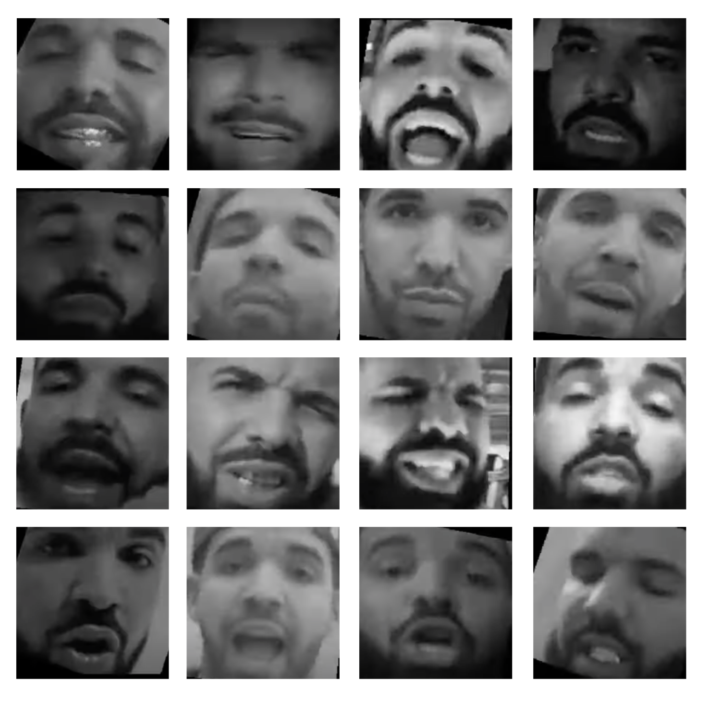

# Visual Databases Project - Facial Performance Videos Generated by Individual Frames Across Other Works

## Overview

### Goal

The goal of this project is to create a video of a music artist performing an existing song, but rather than recording them, each frame of the video comes from a different music video, where their facial expressions matches how they appear in the existing song.



### Process

The process starts with analyzing a set of of music videos based on a handful of example images of the performing artists. The videos will be analyzed frame by frame to check if they include the artist or not, using facial recognition. For those that do contain the artist, they will then be labeled according to the current position of the artist's mouth - how open or closed it is, and how relatively wide it is. Finally, those frames will all be set to black-and-white (to minimize visual distraction), and rotated in order to set the performer's head as vertically straight as possible.

Once the frames are compiled, a new music video will be created using the collection of labeled frames in order to match the same mouth movements as the ones in a randomly selected music video from the original set of videos.

## Installation

This project requires:
- macOS with at least 5 GB of free space
- [Python 3.6+](https://www.python.org/)
- [Git](https://git-scm.com/)
- [FFmpeg](https://ffmpeg.org/)
- [youtube-dl](https://ytdl-org.github.io/youtube-dl/index.html)
- [face_recognition](https://github.com/ageitgey/face_recognition)

## Usage

### 1. Download
```bash
git clone https://github.com/QuinnTorres/university-project--visual-databases;
```

### 2. Example Images and Videos of the Artist
Add to the `/examples/` folder a new folder, named after your artist, with around `10` example images of the artist's face that you would like to keep track of. Also create a `videos.txt` file with one YouTube link per line, of a music video you would like to use.

### 3. Run


#### Simple

```bash
python3 run.py --video-url-file videos.txt --video-directory videos/ --examples examples/ --sets-of-images images/ --name <artist name> --sets-of-adjustments images/ --reference-directory images/ -s
```

#### See All Available Options

```bash
python3 run.py --help
```

# Example Output

[View Here](https://www.youtube.com/watch?v=WKE6Co3G1B0)